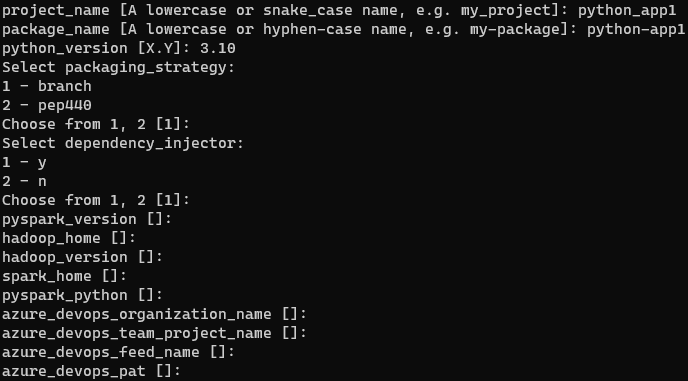

# Introduction

A [cookiecutter](https://github.com/cookiecutter/cookiecutter) template for a python package.

Optionally, you can add everything you need to work with [pyspark](https://spark.apache.org/docs/latest/api/python/) and even GitHub worfklows for a continuous integration and deployment environment, for publishing the package in a private [Azure DevOps feed](https://docs.microsoft.com/en-us/azure/devops/artifacts/concepts/feeds?view=azure-devops).

# Usage

```bash
pip install cookiecutter
cookiecutter https://github.com/panicoenlaxbox/cookiecutter-pythonpackage
```

## Parameters

| Parameter | Description |
| -------------- | ------------------------------------------------------------ |
| project_name | A lowercase or snake_case name, e.g. my_project |
| package_name | A lowercase or hyphen-case name, e.g. my-package |
| python_version | Python version in the format X.Y |
| packaging_strategy | branch or 440 |
| pyspark_version | https://pypi.org/project/pyspark/ |
| hadoop_home | `%HADOOP_HOME%` environment variable |
| hadoop_version | https://github.com/vemonet/setup-spark |
| spark_home | `%SPARK_HOME%` environment variable |
| pyspark_python | `%PYSPARK_PYTHON%` environment variable |   
| azure_devops_organization_name | Azure DevOps Organization name |
| azure_devops_team_project_name | Azure DevOps Team Project name |
| azure_devops_feed_name | Azure DevOps Feed name |
| azure_devops_pat | Azure DevOps PAT |



### Packaging strategy

For branches other that main:

- `branch` will build packages with the name `package_name`-`<branch>`.
    - *In practice, different packages.*
- `440` will build packages with the name `package_name.dev`, according to https://www.python.org/dev/peps/pep-0440/. 
    - *The same package in pre-release version.*

### pyspark

This project is very influenced by the way of installing pyspark that is explained in this post https://www.panicoenlaxbox.com/post/install-spark-on-windows/

If you don't want to include `pyspark`, leave blank the field `pyspark_version`, `hadoop_home`, `hadoop_version`, `spark_home` and `pyspark_python`.

# Project structure

- `.github\`
- `{{cookiecutter.project_name}}\`
- `tests\`
- `.coveragerc`
    - https://github.com/nedbat/coveragepy
- `.editorconfig`
    - https://editorconfig.org/
- `.env`
    - https://pipenv-fork.readthedocs.io/en/latest/advanced.html#automatic-loading-of-env
- `.flake8`
    - https://flake8.pycqa.org/en/latest/user/configuration.html
- `.gitignore`
- `.pre-commit-config.yaml`
    - https://pre-commit.com/#adding-pre-commit-plugins-to-your-project
- `mypy.ini`
    - https://mypy.readthedocs.io/en/stable/config_file.html
- `Pipfile`
    - https://pipenv.pypa.io/en/latest/
- `publish.ps1`
    - PowerShell script for publishing a package
- `pyproject.toml`
    - https://www.python.org/dev/peps/pep-0518/
- `pytest.ini`
    - https://docs.pytest.org/en/6.2.x/customize.html#pytest-ini
- `README.md`
- `setup.py`
    - https://setuptools.readthedocs.io/en/latest/index.html

# Generated project

## Installation

```bash
pipenv install --dev  # Install packages in development mode
git init
pipenv shell  # Activate the virtual environment
pre-commit install  # Install pre-commit hooks
pre-commit autoupdate  # Because pre-commit rev could have changed
git add .
git commit -m "Initial commit"
```

## Usage

```bash
python -m <project_name>.main
pytest
```

```bash
pipenv run test
pipenv run cov
pipenv run publish
```

## Deploying

Regardless of what was chosen in the field `packaging_strategy`, you can choose different approaches for publishing the package in relation to the dependencies.

If `setup.py` finds a `requirements.txt`, it will use it for pinning dependencies, otherwise it will use `Pipfile` only will take care about your direct dependencies.

If you use `publish.ps1`, `requirements.txt` will be created prior to run `pipenv run publish` script command. Futhermore, `requirements.txt` is excluded in `.gitignore` because it could contain the token supplied during the project generation, `pipenv lock -r > requirements.txt` will be dump it in the file header.

In both cases, you can skip specific packages to be included in the final package, editing the `setup.py` file and variable `excluded_packages`.

`publish.ps1` is used in the GitHub Action because I assume that you are developing an application, but if it isn't your case and you want to distribute a package for third parties, may be you shouldn't pin your dependencies and left them opened for easily integration with the consumer application. In this case, feel free to change the call to `publish.ps1` in [cd.yml]({{cookiecutter.project_name}}/.github/workflows/cd.yml) for a single call to `pipenv run publish`.

## AZURE_DEVOPS_PAT

This environment variable is used by Pipenv to download packages from a private feed.

During the project generation and, if you choose to create the pipelines, it's written in `.env` file that it's excluded from source control in `.gitignore` file.

If you want to change the default location of `.env` file, you can use [PIPENV_DOTENV_LOCATION](https://pipenv.pypa.io/en/latest/advanced/#pipenv.environments.PIPENV_DOTENV_LOCATION)

## PyCharm

### pytest

You must go to Settings > Tools > Python Integrated Tools and select pytest like default test runner.

### Environment variables

PyCharm/pipenv have a bug and `.env` files are not loaded in Terminal [Terminal not loading environmental variables with PIPENV](https://intellij-support.jetbrains.com/hc/en-us/community/posts/360001761299-Terminal-not-loading-environmental-variables-with-PIPENV), so you should execute `pipenv shell` in PyCharm Terminal every time you open it.

### Run/Debug configuration

For using `.env` file with a PyCharm Run/Debug configuration, you should install [EnvFile](https://plugins.jetbrains.com/plugin/7861-envfile) plugin and choose the `.env` file to be loaded.

## GitHub

### Secrets

You must set the following secrets in the repository:

- `AZURE_DEVOPS_PAT`, a PAT for reading your private feed.
- `TWINE_PASSWORD`, a PAT for writing your private feed.

If you want, both can be the same PAT.

Moreover, although in `ci.yml` and `cd.yml` you will find the python version that you specified during the bootstraping, you should check it and ensure that it's aligned with available versions in https://raw.githubusercontent.com/actions/python-versions/main/versions-manifest.json

### Badges

You must fix the badge url in `README.md` with the right repository name for properly displaying.